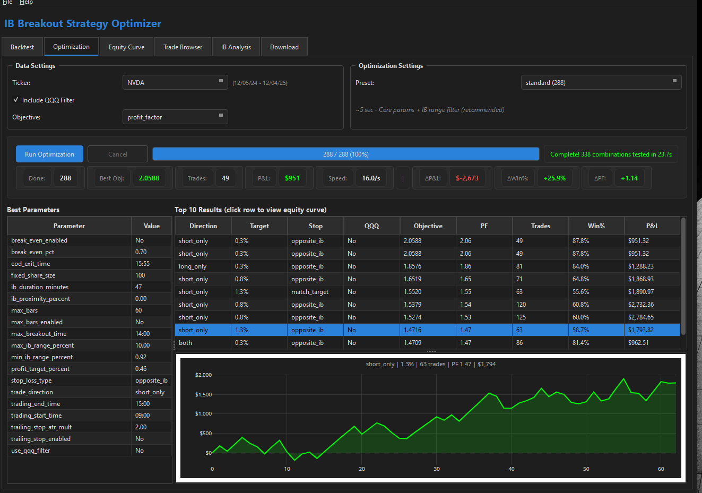

# IB Breakout Strategy Optimizer

A comprehensive Python backtesting and optimization framework for the Initial Balance (IB) Breakout trading strategy. Designed to work in tandem with NinjaTrader for live trading execution.

## Overview

The IB Breakout strategy trades breakouts from the "Initial Balance" - the price range established during the first 30 minutes (configurable) of the trading session. This tool allows you to:

- **Backtest** the strategy with historical data
- **Optimize** parameters using grid search or Bayesian optimization
- **Analyze** performance with interactive charts and metrics
- **Export** optimal parameters for NinjaTrader live trading

## Features

### Desktop Application (PySide6)
A native desktop app with real-time progress updates and professional UI:



- **Backtest Tab**: Run single backtests with configurable parameters
- **Optimization Tab**: Grid search with live progress, elapsed time, and ETA
- **Equity Curve Tab**: Interactive equity and drawdown charts
- **Trade Browser Tab**: Browse trades with candlestick charts and entry/exit markers
- **IB Analysis Tab**: Performance heatmaps by IB size, day-of-week, entry hour

### Backtesting Engine
- Event-driven architecture for accurate simulation
- Support for multiple exit strategies:
  - Fixed profit targets
  - Opposite IB level stops
  - Trailing stops (ATR-based)
  - Break-even stops
  - Max bars exit
  - End-of-day exit
- QQQ filter for confirmation (requires QQQ to break its IB before entry)
- Multi-ticker support (TSLA, QQQ, AAPL, NVDA, MSFT)

### Optimization
- **Two-Phase Optimization**: Grid search followed by Bayesian refinement (always on)
- **Memory-Efficient**: Uses memory-mapped NumPy arrays for 80-90% memory reduction
- **Real-time Progress**: Live updates during optimization with speed metrics
- **Delta Metrics**: Shows improvement vs previous run (ΔP&L, ΔWin%, ΔPF)
- **Equity Curve Preview**: Click any result to see its equity curve
- **Results Persistence**: Last optimization restored on app launch
- **Optimization Presets**:
  - `quick`: 96 combinations (~5 sec) - fast testing
  - `standard`: 288 combinations (~8 sec) - recommended
  - `full`: 1,152 combinations (~20 sec) - all parameters
  - `thorough`: 2,592 combinations (~40 sec) - fine-grained search
- Customizable objective functions (Sharpe, Sortino, Profit Factor, etc.)

### Web UI (Streamlit) - Alternative
- Parameter configuration and backtest execution
- Trade browser with candlestick charts showing entry/exit markers
- Equity curve and drawdown visualization
- Monthly returns heatmap
- Performance analysis by day-of-week and entry hour
- Load and compare saved optimization results

### Performance Metrics
- Total P&L, Win Rate, Profit Factor
- Sharpe Ratio, Sortino Ratio, Calmar Ratio
- Maximum Drawdown ($ and %)
- Average Winner/Loser, Max Consecutive Wins/Losses
- Trade-level breakdown by direction, exit reason

## Installation

### Prerequisites
- Python 3.10+
- pip package manager

### Setup

```bash
# Navigate to project directory
cd C:\Users\Warren\Projects\ib_breakout_optimizer

# Install dependencies
pip install pandas numpy optuna plotly streamlit pyarrow pyyaml requests PySide6 joblib

# Or use requirements.txt
pip install -r requirements.txt
```

### Data Setup

Place your historical data files in the data directory (default: `C:\Users\Warren\Downloads`):

- **NinjaTrader format** (preferred): `TSLA_NT.txt`, `QQQ_NT.txt`
  ```
  20240102 093000;239.25;239.50;239.00;239.45;125000;0
  ```
- **CSV format**: `TSLA.csv`
  ```csv
  timestamp,open,high,low,close,volume
  2024-01-02 09:30:00,239.25,239.50,239.00,239.45,125000
  ```

## Usage

### Desktop App (Recommended)

**Option 1: Desktop Shortcut**
Double-click the "IB Breakout Optimizer" shortcut on your desktop.

**Option 2: Command Line**
```bash
cd C:\Users\Warren\Projects\ib_breakout_optimizer
python -m desktop_ui.main
```

**Option 3: Batch File**
```bash
run_optimizer.bat
```

### Desktop App Features

#### Backtest Tab
1. Select ticker (TSLA, QQQ, AAPL, NVDA, MSFT)
2. Configure parameters (direction, profit target, stop loss, etc.)
3. Enable/disable QQQ filter
4. Click **Run Backtest**
5. View metrics and trade list

#### Optimization Tab
1. Select ticker and objective function (Sharpe, Sortino, Profit Factor, etc.)
2. Choose preset:
   - **quick**: 96 combinations (~5 sec) - fast testing
   - **standard**: 288 combinations (~8 sec) - recommended
   - **full**: 1,152 combinations (~20 sec) - all parameters
   - **thorough**: 2,592 combinations (~40 sec) - fine-grained search
3. Click **Run Optimization**
4. Watch live progress with elapsed time, ETA, and speed
5. View best parameters and top 10 results
6. Click any result row to see its equity curve
7. Compare to previous run with delta metrics (ΔP&L, ΔWin%, ΔPF)

The optimizer uses Two-Phase search (Grid + Bayesian) with memory-mapped arrays for efficient parallel processing.

#### Trade Browser Tab
- Browse all trades from the last backtest
- Filter by date, direction, win/loss
- Click a trade to see candlestick chart with entry/exit markers

#### Equity Curve Tab
- View cumulative P&L and drawdown
- Monthly returns heatmap

#### IB Analysis Tab
- Performance by IB size buckets
- Day-of-week analysis
- Entry hour analysis

### Web Interface (Alternative)

```bash
cd C:\Users\Warren\Projects\ib_breakout_optimizer
streamlit run ui/app.py
```

Open your browser to `http://localhost:8501`

### Programmatic Usage

```python
from backtester.backtest_runner import BacktestRunner
from strategy.ib_breakout import StrategyParams

# Create runner
runner = BacktestRunner(r"C:\Users\Warren\Downloads")

# Configure strategy
params = StrategyParams(
    ib_duration_minutes=30,
    profit_target_percent=1.0,
    stop_loss_type="opposite_ib",
    trade_direction="long_only",
    use_qqq_filter=True
)

# Run backtest with QQQ filter
result, metrics = runner.run_backtest_with_filter(
    ticker="TSLA",
    filter_ticker="QQQ",
    params=params
)

# Print report
runner.print_full_report()
print(f"Sharpe Ratio: {metrics.sharpe_ratio:.2f}")
print(f"Total P&L: ${metrics.total_net_profit:,.2f}")
```

### Command Line Interface

```bash
# Run single backtest
python scripts/run_backtest.py --ticker TSLA --profit-target 1.0 --use-qqq-filter

# Run optimization
python scripts/run_optimization.py --mode grid --ticker TSLA --objective sharpe_ratio
```

## Project Structure

```
ib_breakout_optimizer/
├── config/                    # Configuration files
│   ├── settings.yaml          # Global settings
│   └── tickers.yaml           # Ticker-specific config
│
├── data/                      # Data pipeline
│   ├── data_loader.py         # File loading
│   ├── data_types.py          # Data classes
│   ├── session_builder.py     # Session construction
│   └── cache_manager.py       # Caching utilities
│
├── strategy/                  # Strategy logic
│   ├── ib_breakout.py         # Main strategy
│   ├── ib_calculator.py       # IB calculation
│   ├── signal_generator.py    # Entry signals
│   ├── filters.py             # Trade filters
│   └── exits.py               # Exit logic
│
├── backtester/                # Backtest engine
│   ├── backtest_runner.py     # Main runner
│   ├── event_engine.py        # Event processing
│   ├── order_simulator.py     # Order fills
│   └── position_tracker.py    # Position management
│
├── metrics/                   # Performance analysis
│   ├── performance_metrics.py # Metric calculations
│   └── trade_analyzer.py      # Trade statistics
│
├── optimization/              # Parameter optimization
│   ├── parameter_space.py     # Parameter definitions & presets
│   ├── mmap_data.py           # Memory-mapped data manager
│   ├── mmap_grid_search.py    # Memory-efficient grid search (default)
│   ├── grid_search.py         # Legacy grid search
│   ├── bayesian_optuna.py     # Optuna optimizer
│   ├── two_phase_optimizer.py # Grid + Bayesian hybrid
│   └── walk_forward.py        # Walk-forward analysis
│
├── desktop_ui/                # PySide6 Desktop App (Primary)
│   ├── main.py                # App entry point
│   ├── main_window.py         # Main window with tabs
│   ├── tabs/
│   │   ├── backtest_tab.py    # Backtest configuration
│   │   ├── optimization_tab.py # Grid search with progress
│   │   ├── equity_curve_tab.py # Equity/drawdown charts
│   │   ├── trade_browser_tab.py # Trade list with charts
│   │   └── ib_analysis_tab.py # IB size/day analysis
│   ├── workers/
│   │   ├── backtest_worker.py # Background backtest thread
│   │   └── optimization_worker.py # Background optimization thread
│   └── widgets/
│       ├── metrics_panel.py   # Metric display cards
│       └── chart_widget.py    # Plotly chart container
│
├── ui/                        # Streamlit interface (Alternative)
│   ├── app.py                 # Main app
│   ├── pages/                 # UI pages
│   │   ├── backtest.py
│   │   ├── trade_browser.py
│   │   ├── equity_curve.py
│   │   ├── optimization.py
│   │   └── results_viewer.py
│   └── components/            # Reusable components
│       ├── candlestick_chart.py
│       └── trade_table.py
│
├── output/                    # Results storage
│   └── optimization/          # Saved optimizations
│
├── scripts/                   # CLI tools
│   ├── run_backtest.py
│   └── run_optimization.py
│
├── run_optimizer.bat          # Desktop app launcher
├── create_shortcut.ps1        # Desktop shortcut creator
├── CLAUDE.md                  # Claude Code context
└── README.md                  # This file
```

## Strategy Parameters

### Entry Parameters
| Parameter | Range | Description |
|-----------|-------|-------------|
| `ib_duration_minutes` | 15-60 | Initial Balance window size |
| `trade_direction` | long_only, short_only, both | Trading direction |
| `max_breakout_time` | 10:00-15:00 | Latest time to enter |

### Exit Parameters
| Parameter | Range | Description |
|-----------|-------|-------------|
| `profit_target_percent` | 0.3-3.0 | Target as % of entry price |
| `stop_loss_type` | opposite_ib, match_target | Stop loss method |
| `trailing_stop_enabled` | bool | Enable trailing stop |
| `trailing_stop_atr_mult` | 0.5-4.0 | Trailing distance in ATR |
| `break_even_enabled` | bool | Move stop to breakeven |
| `break_even_pct` | 0.5-0.9 | Trigger % to target |
| `max_bars` | 10-120 | Max bars before exit |
| `eod_exit_time` | 15:30-15:55 | End-of-day exit time |

### Filter Parameters
| Parameter | Range | Description |
|-----------|-------|-------------|
| `use_qqq_filter` | bool | Require QQQ IB break |
| `min_ib_range_percent` | 0.0-2.0 | Minimum IB size |
| `max_ib_range_percent` | 1.0-10.0 | Maximum IB size |

### Trade Filters (NEW)
Optimizable filters to improve trade quality:

| Parameter | Options | Description |
|-----------|---------|-------------|
| `gap_filter_enabled` | bool | Filter by gap % (today's open vs yesterday's close) |
| `gap_direction_filter` | any, gap_up_only, gap_down_only, with_trade | Gap direction requirement |
| `prior_days_filter_enabled` | bool | Filter by prior days trend |
| `prior_days_trend` | any, bullish, bearish, with_trade | Trend direction requirement |
| `daily_range_filter_enabled` | bool | Filter by daily range % (volatility) |
| `min_avg_daily_range_percent` | 0.0-3.0 | Minimum average daily range required |

The `with_trade` option aligns the filter with trade direction:
- **Gap with_trade**: Long trades allowed on gap-up days, short on gap-down
- **Trend with_trade**: Long trades allowed when prior days bullish, short when bearish

**Example Results (TSLA 2023-2024):**
| Configuration | Trades | Profit Factor |
|--------------|--------|---------------|
| No filters | 266 | 1.27 |
| Gap filter (with_trade) | 237 | 1.35 |
| All filters optimized | 70 | 2.30 |

## QQQ Filter Explained

The QQQ filter adds confirmation by requiring the QQQ ETF to break its Initial Balance before allowing entries on the primary ticker (e.g., TSLA):

- **For Long Entries**: QQQ must break above its IB High before TSLA
- **For Short Entries**: QQQ must break below its IB Low before TSLA

This filter can significantly improve win rates by avoiding trades during choppy market conditions.

**Example Results (TSLA 2023-2024):**
| Metric | Without QQQ Filter | With QQQ Filter |
|--------|-------------------|-----------------|
| Sharpe Ratio | -3.05 | 2.02 |
| Total P&L | -$6,934 | +$4,098 |
| Win Rate | 38% | 54% |

## Matching NinjaTrader Logic

The backtester is designed to match NinjaTrader results:

1. **IB Period**: Starts at 9:30 AM ET, ends after `ib_duration_minutes`
2. **Bar Timing**: NinjaTrader timestamps bars at the START of the bar
3. **IB Lock-in**: IB is locked on the first bar AT or AFTER IB end time
4. **Breakout Detection**:
   - Long: Close > IB High
   - Short: Close < IB Low

### Validation Process
1. Use identical parameters in both systems
2. Run on the same date range
3. Compare trade-by-trade: times, prices, P&L
4. Expected tolerance: <1% P&L difference

## Development Progress

### Completed Phases
- [x] Phase 1: Data pipeline and IB calculator
- [x] Phase 2: Full backtester with advanced exits
- [x] Phase 3: Optimization engine (Grid, Bayesian, Walk-Forward, Trade Filters)
- [x] Phase 4: Interactive Desktop & Web UI
- [x] Phase 5: Continuous learning system (monitoring, regime detection, alerts)

### Planned Phases
- [ ] Phase 6: ML trade filter
  - Feature engineering
  - Win/loss prediction model
  - Probability-based filtering
- [ ] Phase 7: Portfolio View
  - Multi-ticker optimization
  - Combined equity curves
  - Correlation analysis

## Dependencies

```
pandas>=2.0
numpy>=1.24
optuna>=3.0
plotly>=5.0
streamlit>=1.28
pyarrow>=12.0
pyyaml>=6.0
requests>=2.31
PySide6>=6.5
joblib>=1.3
```

## Troubleshooting

### Common Issues

1. **"No data files found"**
   - Ensure data files are in the correct directory
   - Files should have ticker name in filename (e.g., `TSLA_NT.txt`)

2. **"QQQ filter enabled but no QQQ data"**
   - Place `QQQ_NT.txt` in the same data directory as TSLA data

3. **"No trades generated"**
   - Check date range has trading data
   - Verify IB duration isn't too long for available data
   - Try loosening filters (disable QQQ filter, expand IB range limits)

4. **Memory issues during optimization**
   - The default mmap optimizer should handle large grids without issues
   - If still experiencing issues, use a smaller preset (quick/standard)
   - Reduce number of parallel workers with `n_jobs` parameter

## License

Private project - All rights reserved.

## Related Files

- **NinjaTrader Strategy**: `QQQIBBreakout.cs`
- **Claude Context**: See `CLAUDE.md` for development context
